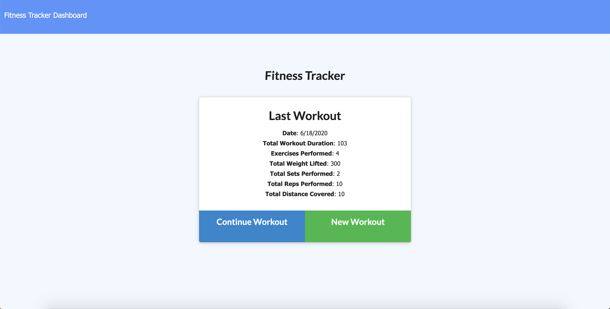
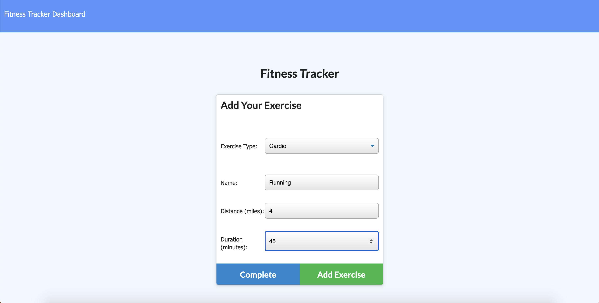
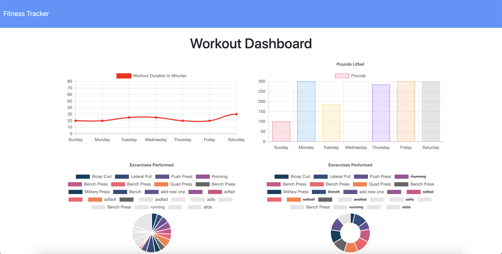

# Workout-Tracker README

# Table of contents
1. [Project Description](#descriptionLink)
2. [Usage](#usageLink)
3. [UI](#uiLink)
4. [Version](#versionLink)
5. [Stack](#dependenciesLink)
6. [Contact](#contactLink)


----

## Project Descripton <a name="descriptionLink"></a>
This Workout Tracker App allows a user to save their workout info. A new workout is created by saving an exercise with some additional details. New exercises can be added to each workout. A summary of all exercises of the most recent workout is displayed on the home page and a full summary with colorful, animated charts and graphs can be found on the dashboard (/stats) page.

## Usage <a name="usageLink"></a>
To install dependencies run ```npm i```
To seed database ```npm run seed```
To start application, run ```npm start```

## UI <a name="uiLink"></a>




## Version <a name="versionLink"></a>


## Stack  <a name="dependenciesLink"></a>

-MongoDB and mongoose
-Express
-Node.js

## Contact <a name="contactLink"></a>


 
#### Github Username: [@reyesdmusic](https://www.github.com/reyesdmusic)
#### Email: reyesdmusic@gmail.com